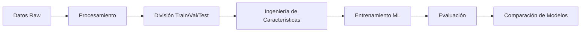

# Análisis y Predicción de Registros de Viajes en Taxi de Nueva York

## Descripción del Proyecto

Este proyecto de aprendizaje automático utiliza la metodología CRISP-DM para analizar y predecir patrones en los registros de viajes de taxi amarillo de Nueva York. El proyecto procesa datos históricos de la Comisión de Taxis y Limusinas de NYC (TLC) desde 2009 hasta 2023, aplicando técnicas avanzadas de ciencia de datos y machine learning para extraer insights valiosos y crear modelos predictivos.

## Autores

- Luis Salamanca
- Brahian Gonzales

## Fuente de Datos

Los datos provienen de los **Registros de Viajes TLC (Trip Record Data)** de la Ciudad de Nueva York. Los registros de taxis amarillos incluyen campos que capturan:

- Fechas y horas de recogida y destino
- Ubicaciones de recogida y destino (LocationID)
- Distancias de viaje
- Tarifas detalladas (fare, extra, mta_tax, tip_amount, tolls_amount)
- Tipos de tarifa y formas de pago
- Número de pasajeros reportado por el conductor
- Recargos por congestión y aeropuerto

> 📋 **Para información detallada sobre la obtención, estructura y análisis técnico de los datos**, consulte la [documentación específica de datos raw](data/01_raw/README.md).

### Características del Dataset

- **Período**: 2009-2023 (171 archivos mensuales)
- **Formato**: Archivos Parquet optimizados
- **Volumen**: **1,708,142,581 registros totales** (~1.7 mil millones)
- **Campos**: 44 variables únicas (18-19 por archivo según época)
- **Tamaño**: **27.8 GB** de datos comprimidos
- **Esquemas**: 3 grupos evolutivos (2009, 2010, 2011-2023)
- **Actualización**: Datos oficiales publicados por NYC TLC

## Análisis Técnico del Dataset

### Evolución Temporal del Esquema

El análisis de esquemas revela **3 períodos distintos** en la estructura de datos:

#### Período 1: 2009-2010 (Esquema Legacy)
- **Variables**: 18 campos
- **Características**: Nombres de columnas descriptivos en inglés
- **Ejemplo**: `Trip_Pickup_DateTime`, `Passenger_Count`, `Fare_Amt`
- **Volumen**: ~14.9M registros/mes
- **Tamaño**: 448-492 MB/archivo

#### Período 2: 2011-2023 (Esquema Estándar TLC)
- **Variables**: 19 campos estandarizados
- **Características**: Nomenclatura oficial TLC
- **Variables clave**: `VendorID`, `tpep_pickup_datetime`, `PULocationID`
- **Campos monetarios**: `fare_amount`, `tip_amount`, `total_amount`
- **Campos especiales**: `congestion_surcharge` (2014+), `airport_fee` (2018+)

### Análisis de Volumen por Año

| Año | Registros (millones) | Tamaño total (GB) | Tendencia |
|-----|---------------------|-------------------|----------|
| 2009-2010 | 339.9M | 10.6 GB | **Pico histórico** |
| 2011-2015 | 830.3M | 10.1 GB | Volumen máximo |
| 2016-2019 | 432.1M | 5.8 GB | Declive gradual |
| 2020-2021 | 55.6M | 0.8 GB | **Impacto COVID-19** |
| 2022-2023 | 49.0M | 0.7 GB | Recuperación parcial |

**Datos Clave del Análisis:**
- **Variable única común**: Solo `mta_tax` presente en todos los años
- **Mejor estrategia**: Consolidar por períodos (2011-2023 = 1.37B registros)
- **Calidad**: >95% completitud en campos core, anomalías detectadas

### Variables por Período

**Variables consistentes (2011-2023):**
- `VendorID`: Identificador del proveedor
- `tpep_pickup_datetime` / `tpep_dropoff_datetime`: Timestamps de recogida/destino
- `passenger_count`: Número de pasajeros
- `trip_distance`: Distancia del viaje
- `PULocationID` / `DOLocationID`: IDs de zonas de recogida/destino
- `fare_amount`, `tip_amount`, `total_amount`: Componentes monetarios

**Variables evolutivas:**
- `congestion_surcharge`: Nula 2011-2013, presente 2014+
- `airport_fee`: Nula hasta 2017, presente 2018+
- Tipos de datos: `passenger_count` cambió de `int64` a `double` en 2019

### Recomendaciones de Consolidación

#### Estrategia Recomendada: Normalización por Períodos

1. **Grupo Legacy (2009-2010)**
   - Mapeo manual de nombres de columnas
   - Transformación a esquema estándar TLC
   - Volumen: 29M registros, 940 MB

2. **Grupo Principal (2011-2023)**
   - Esquema homogéneo con 17 variables comunes
   - Manejo de campos evolutivos como opcionales
   - Volumen: 140M registros, 2.3 GB

#### Implementación Técnica

```python
# Esquema target unificado (17 variables core)
CORE_SCHEMA = [
    'vendor_id', 'pickup_datetime', 'dropoff_datetime',
    'passenger_count', 'trip_distance', 'pickup_location_id',
    'dropoff_location_id', 'rate_code', 'store_and_fwd_flag',
    'payment_type', 'fare_amount', 'extra', 'mta_tax',
    'tip_amount', 'tolls_amount', 'improvement_surcharge',
    'total_amount'
]

# Campos opcionales por período
OPTIONAL_FIELDS = {
    'congestion_surcharge': '2014+',
    'airport_fee': '2018+'
}
```

### Calidad de Datos Observada

- **Completitud**: >95% en campos core
- **Consistencia**: Tipos de datos estables excepto cambios documentados
- **Integridad**: LocationIDs válidos, timestamps correctos
- **Anomalías detectadas**: Valores extremos en distancias y tarifas (requieren filtrado)

## Metodología CRISP-DM

### 1. Comprensión del Negocio
- **Objetivo**: Desarrollar modelos predictivos para optimizar operaciones de taxis
- **Casos de uso**: Predicción de tarifas, análisis de patrones temporales, optimización de rutas

### 2. Comprensión de los Datos
- **Análisis Exploratorio (EDA)**: Distribuciones, correlaciones, patrones temporales
- **Calidad de datos**: Identificación de valores nulos, outliers, inconsistencias
- **Segmentación**: Análisis por zonas, horarios, tipos de viaje

### 3. Preparación de los Datos
- **Limpieza**: Tratamiento de valores faltantes y outliers
- **Transformación**: Codificación de variables categóricas
- **Ingeniería de características**: Creación de variables derivadas

### 4. Modelado
- **Algoritmos implementados**:
  - Regresión Lineal
  - Random Forest
  - XGBoost
  - LightGBM

### 5. Evaluación
- **Métricas**: RMSE, MAE, R²
- **Validación**: División train/validation/test (64%/16%/20%)
- **Comparación de modelos**: Análisis de rendimiento

### 6. Despliegue
- **Contenedores Docker**: Orquestación completa del pipeline
- **Visualización**: Kedro Viz para monitoreo del pipeline
- **Notebooks**: Análisis interactivo con Jupyter Lab

## Arquitectura del Proyecto

### Estructura de Directorios

```
TaxiTripRecords/
├── data/                           # Gestión de datos por capas
│   ├── 01_raw/                     # Datos originales (Parquet files)
│   ├── 02_intermediate/            # Datos procesados
│   ├── 03_primary/                 # Datos primarios limpios
│   ├── 04_feature/                 # Características engineered
│   ├── 05_model_input/             # Datos para entrenamiento
│   ├── 06_models/                  # Modelos entrenados
│   ├── 07_model_output/            # Predicciones
│   └── 08_reporting/               # Reportes y métricas
├── src/taxi_ml/                    # Código fuente
│   ├── pipelines/
│   │   ├── data_processing/        # Pipeline de procesamiento
│   │   └── data_science/           # Pipeline de ML
│   └── pipeline_registry.py       # Registro de pipelines
├── conf/                           # Configuraciones
│   ├── base/
│   │   ├── catalog.yml             # Catálogo de datasets
│   │   └── parameters.yml          # Hiperparámetros
│   └── local/                      # Configuraciones locales
├── notebooks/                      # Análisis exploratorio
├── tests/                          # Tests automatizados
└── docker-compose.yml             # Orquestación de servicios
```

### Pipelines Kedro

#### Pipeline de Procesamiento de Datos
```
Datos Raw → Limpieza → Transformación → División → Datos de Entrada
```

**Nodos principales**:
- `preprocess_taxi_data()`: Limpieza y transformación inicial
- `split_data()`: División en conjuntos train/val/test

#### Pipeline de Ciencia de Datos
```
Ingeniería de Características → Entrenamiento → Evaluación → Comparación
```

**Nodos principales**:
- `prepare_features()`: Codificación y escalado de características
- `train_*_model()`: Entrenamiento de 4 algoritmos ML
- `evaluate_model()`: Cálculo de métricas de rendimiento
- `compare_models()`: Reporte comparativo de modelos

### Flujo de Datos



## Comandos de Ejecución

### Usando Docker Compose (Recomendado)

#### Ejecución Completa del Pipeline
```bash
# Pipeline completo de ML
docker-compose up airlines-ml

# Solo procesamiento de datos
docker-compose up data-processing

# Solo entrenamiento ML
docker-compose up ml-training
```

#### Servicios de Desarrollo
```bash
# Visualización del pipeline (http://localhost:4141)
docker-compose up kedro-viz

# Jupyter Lab para análisis (http://localhost:8888)
docker-compose up jupyter

# Contenedor de desarrollo interactivo
docker-compose run --rm dev
```

#### Gestión de Servicios
```bash
# Construir todos los servicios
docker-compose build

# Detener todos los servicios
docker-compose down

# Ejecutar tests
docker-compose up test
```

### Ejecución Local

#### Pipeline Operations
```bash
# Pipeline completo
kedro run

# Solo procesamiento de datos
kedro run --pipeline data_processing

# Solo machine learning
kedro run --pipeline data_science

# Reanudar desde nodo específico
kedro run --from-nodes "nombre_del_nodo"
```

#### Herramientas de Desarrollo
```bash
# Instalar dependencias
pip install -r requirements.txt
pip install -e .

# Visualizar pipeline
kedro viz

# Jupyter para exploración
kedro jupyter notebook

# Ejecutar tests
pytest

# Verificar calidad de código
kedro lint
```

#### Gestión de Datos
```bash
# Listar datasets disponibles
kedro catalog list

# Describir dataset específico
kedro catalog describe taxi_raw
```

## Tecnologías y Herramientas

### Frameworks y Librerías
- **Kedro**: Orquestación de pipelines de ML
- **Pandas**: Manipulación y análisis de datos
- **Scikit-learn**: Algoritmos de machine learning
- **XGBoost**: Gradient boosting optimizado
- **LightGBM**: Gradient boosting eficiente

### Infraestructura
- **Docker & Docker Compose**: Contenedorización y orquestación
- **Jupyter Lab**: Desarrollo interactivo
- **Kedro Viz**: Visualización de pipelines
- **pytest**: Framework de testing

### Almacenamiento de Datos
- **Parquet**: Formato columnar optimizado
- **Pickle**: Serialización de modelos
- **CSV**: Reportes y métricas

## Estructura de Archivos de Configuración

### Catálogo de Datos (`conf/base/catalog.yml`)
Define todos los datasets desde datos raw hasta métricas finales:
- Datasets de entrada: formato Parquet
- Modelos y encoders: formato Pickle
- Reportes: formato CSV

### Parámetros (`conf/base/parameters.yml`)
Contiene hiperparámetros para todos los algoritmos ML:
- Random Forest: n_estimators, max_depth, min_samples_split
- XGBoost: learning_rate, subsample, colsample_bytree
- LightGBM: num_leaves, feature_fraction

## Métricas y Evaluación

### Métricas Implementadas
- **RMSE** (Root Mean Square Error)
- **MAE** (Mean Absolute Error)
- **R²** (Coeficiente de Determinación)

### Proceso de Validación
1. División estratificada de datos (64%/16%/20%)
2. Entrenamiento en conjunto de entrenamiento
3. Validación en conjunto de validación
4. Evaluación final en conjunto de prueba
5. Comparación cruzada de todos los modelos

## Casos de Uso

### Análisis Descriptivo
- Patrones temporales de demanda de taxis
- Análisis geográfico por zonas de NYC
- Distribución de tarifas y propinas
- Comportamiento de usuarios por tipo de pago

### Modelos Predictivos
- **Predicción de tarifas**: Estimación de costos de viaje
- **Análisis de demanda**: Patrones de uso por zona/hora
- **Optimización de rutas**: Identificación de rutas eficientes
- **Detección de anomalías**: Viajes inusuales o fraudulentos

## Requisitos del Sistema

### Dependencias Python
- Python >= 3.9
- NumPy < 2.0 (compatibilidad con librerías ML)
- Pandas para manipulación de datos
- Scikit-learn para algoritmos ML base
- Kedro ~= 1.0.0 para orquestación

### Recursos Computacionales
- RAM: Mínimo 8GB (recomendado 16GB+)
- Almacenamiento: 50GB+ para datasets completos
- CPU: Multi-core recomendado para entrenamiento

## Testing

### Estructura de Tests
```bash
tests/
├── pipelines/
│   ├── data_processing/
│   └── data_science/
└── test_run.py
```

### Ejecutar Tests
```bash
# Tests locales
pytest

# Tests en contenedor
docker-compose up test
```

## Próximos Pasos

### Mejoras Planificadas
- Implementación de deep learning (Neural Networks)
- Análisis de series temporales para predicción de demanda
- Integración con APIs de mapas para análisis geoespacial
- Dashboard interactivo para visualización de resultados

### Optimizaciones
- Procesamiento distribuido con Dask
- Hyperparameter tuning automatizado
- MLOps con tracking de experimentos (MLflow)
- Despliegue de modelos como APIs

## Contribuciones

Este proyecto sigue las mejores prácticas de desarrollo de software:
- Código versionado con Git
- Tests automatizados
- Documentación técnica detallada
- Containerización para reproducibilidad

## Licencia

Proyecto académico con fines educativos y de investigación en ciencia de datos aplicada al transporte urbano.

---

*Desarrollado con Kedro Framework y metodología CRISP-DM para análisis profesional de datos de transporte urbano.*